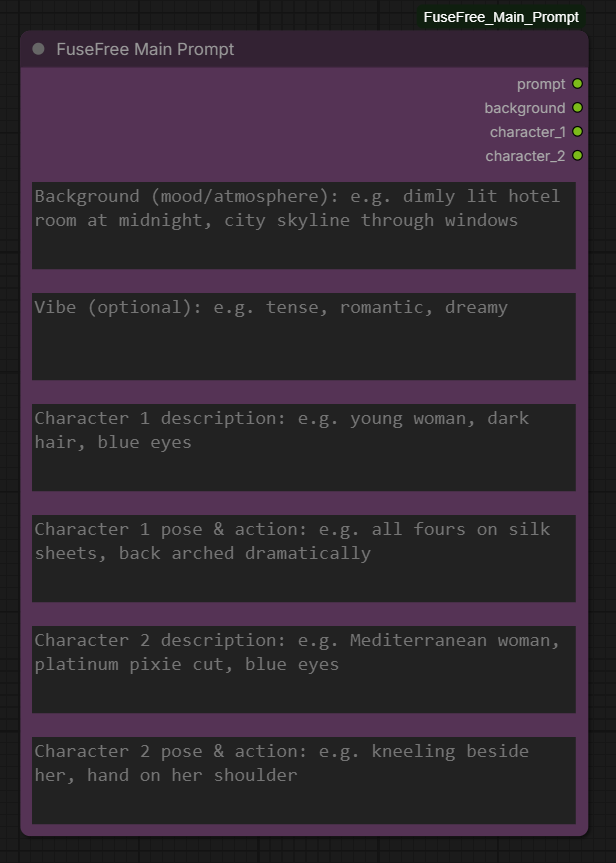

# FreeFuse Main Prompt Custom Node (ComfyUI)

A simple custom node for ComfyUI designed to streamline the prompting process when using the **[FreeFuse](https://github.com/yaoliliu/FreeFuse)** workflow. 

*⚠️ **Note:** This custom node is built specifically to be used alongside the official[FreeFuse ComfyUI extension](https://github.com/yaoliliu/FreeFuse) by yaoliliu.*
When generating multiple AI characters (LoRAs) in the same image, FreeFuse requires a very specific main prompt structure. This node automates that structure. It takes your individual character descriptions and background input, and perfectly combines them so you don't have to manually rewrite the main prompt every time you change an outfit or detail.



### 🌟 What it does:
* **Automates Prompt Formatting:** Automatically merges your Background, Character 1, and Character 2 descriptions into the exact structure FreeFuse needs.
* **Speeds up Workflow:** Change character outfits, poses, or backgrounds in their individual text boxes without having to manually update a massive main prompt.
* **Easy Integration:** Seamlessly connects directly to the FreeFuse Prompt Wrapper and Compute Token Positions nodes.

---

### ⚙️ Installation

1. Navigate to your ComfyUI custom nodes folder:
   `ComfyUI/custom_nodes/`

2. Download the `.zip` file of this repository and extract it inside the `custom_nodes` folder (or clone via Git):

   ```bash
   git clone https://github.com/Aiconomist/ComfyUI_FreeFuse_Main_Prompt.git

3. Restart ComfyUI.
4. You will now find the FuseFree Main Prompt node available in your ComfyUI search menu.
